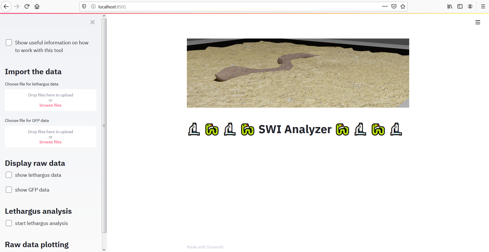
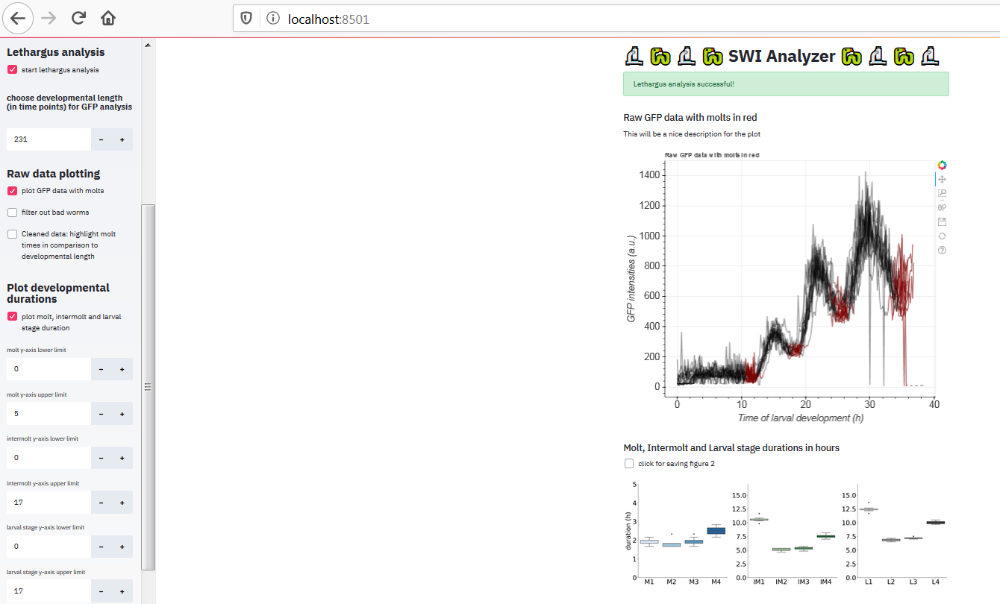

# ggrosshans_SWIanalysis


## Installation

Download the source code
```bash
git clone https://github.com/fmi-basel/ggrosshans_SWIanalysis/tree/GUI_v2.git
```

Enter the directory
```bash
cd ggrosshans_SWIanalysis
```

It is **highly** recommended to create a virtual environment before installing the tool: following:

```bash
virtualenv -p `which python3` venv
```

Activate the virtual environment

```bash
source venv/bin/activate
```

Install required packages
```bash
pip install -r requirements.txt
```

## Run the analysis

Activate the virtual environment

```bash
source venv/bin/activate
```

Run analysis using streamlit

```bash
streamlit run Streamlit_GUI_SWI_final.py
```

A window will pop up as following:



Then upload the **lethargus data** (Lethargus_pYPH5_EV.csv) and the **GFP intensit data** (Kymograph_Quantification.csv) from the examples_files directory. After the import, please follow the checkboxes in the sidebar. It is possible to show the imported lethargus and GFP data, then perform the lethargus analysis and further analyze the GFP data. More checkboxes with further analysis possibilities will appear once the initial analyses were executed.



At the end you can deactivate the virtual environment as following:

```bash
deactivate
```

## Dependencies
- git
- python>=3.5
- virtualenv
- pandas>=0.24
- numpy>=1.14
- bokeh>=2.0.2
- seaborn>=0.9.0
- streamlit>=0.57.1
- matplotlib>=3.0
- scipy>=1.2
- uncertainties>=3.0

## Notes

- Tested on OSX with Python 3.7.3
- Tested on Windows with Python 3.7.3
