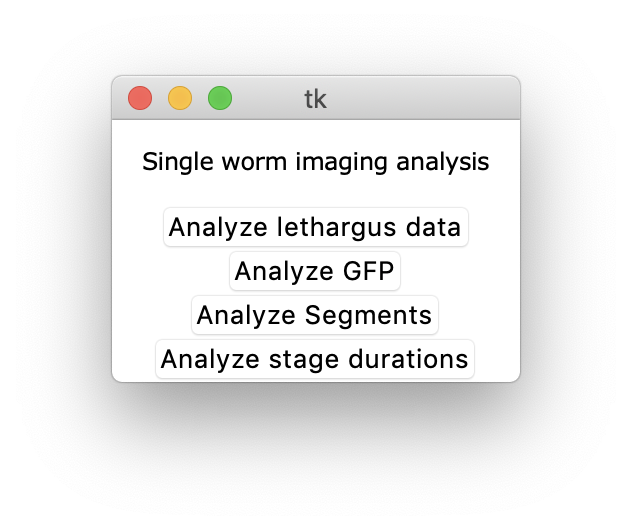
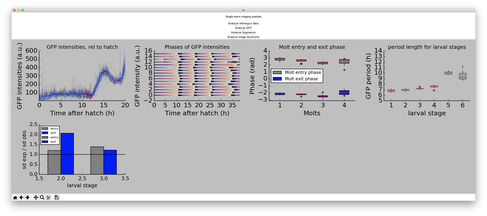

# ggrosshans_SWIanalysis


## Installation

Download the source code
```bash
git clone https://github.com/fmi-basel/ggrosshans_SWIanalysis.git
```

Enter the directory
```bash
cd ggrosshans_SWIanalysis
```

It is **highly** recommended to create a virtual environment before installing the tool: following:

```bash
virtualenv -p `which python3` venv
```

Activate the virtual environment

```bash
source venv/bin/activate
```

Install required packages
```bash
pip install -r requirements.txt
```

## Run the analysis

Activate the virtual environment

```bash
source venv/bin/activate
```

Run analysis

```bash
python SWI_analysis.py
```

A window will pop up as following:



Then press **Analyze lethargus data** and select the file: Lethargus_pYPH5_EV.csv under the examples_files directory. A window will pop up when the analysis is
done. Then press **Analyze GFP** and re-select the same file. Finally select the **Kymograph_Quantification.csv** under the examples_files directory. The final plots should appear in a new window as following:



At the end you can deactivate the virtual environment as following:

```bash
deactivate
```

## Dependencies
- git
- python>=3.5
- virtualenv
- pandas>=0.24
- numpy>=1.14
- matplotlib>=3.0
- scipy>=1.2
- uncertainties>=3.0

## Notes

- Tested on OSX with Python 3.7.3
- Tested on Windows with Python 3.5
